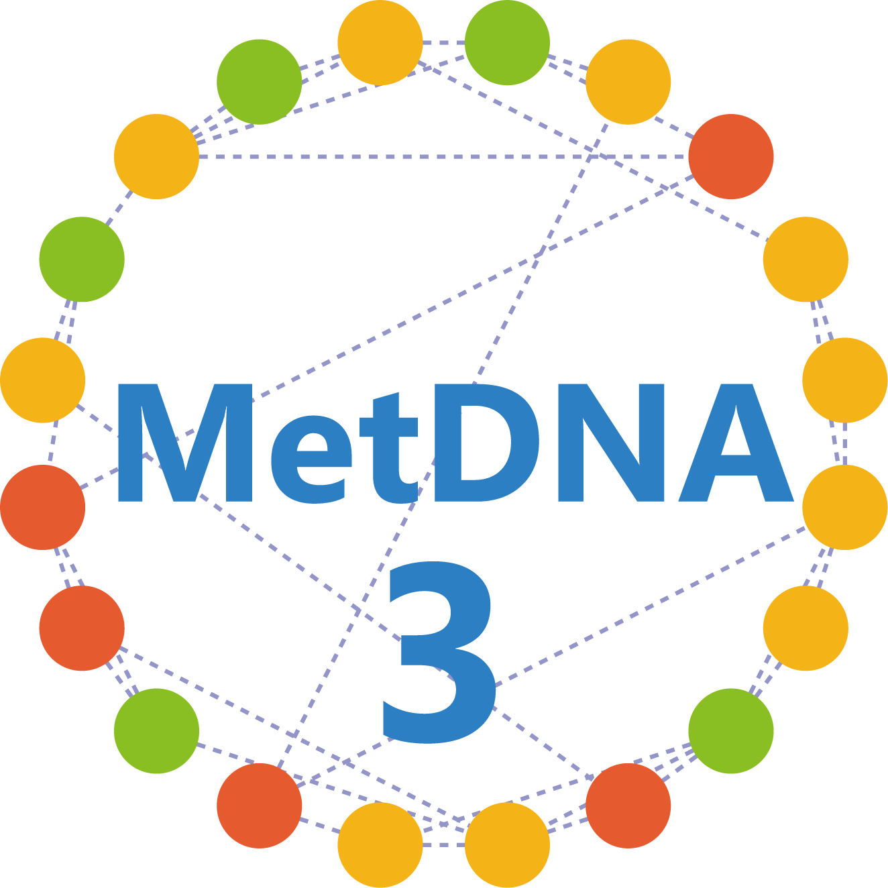

# MrnAnnoAlgo3 (MetDNA3) 

[](https://github.com/ZhuMetLab/MrnAnnoAlgo3)
[](https://creativecommons.org/licenses/by-nc-nd/4.0/)

**Knowledge and Data-driven Two-layer Networking for Accurate Metabolite Annotation in Untargeted Metabolomics**

`MrnAnnoAlgo3` is the core algorithm module of **MetDNA3**, designed to annotate metabolites through a two-layer interactive networking topology (knowledge-driven and data-driven) and recursive annotation propagation algorithms. It provides a robust computational foundation for large-scale metabolomic studies.
**For full functionality, please use [MetDNA3](http://metdna.zhulab.cn/).**

---

## Table of Contents
- [Key Features](#key-features)
- [Installation](#installation)
- [Support](#support)
- [Citation](#citation)
- [Contributing](#contributing)
- [License](#license)

---

## Key Features
✨ **Two-Layer Networking Topology**  
Integrates **knowledge-driven** (biochemical pathways, metabolic reaction networks) and **data-driven** (experimental MS2 similarity networks) layers for comprehensive and accurate metabolite annotation.

⚡ **Recursive Annotation Propagation Algorithm**  
An efficient topology-based annotation propagation algorithm leveraging both network layers to enhance annotation coverage and accuracy.

📊 **High Performance**  
Processes a typical untargeted metabolomics dataset in just one hour—over **10× faster** than previous versions.

🔗 **Seamless Integration**  
Designed as a core component of the MetDNA3 ecosystem.  *Note: Full MetDNA3 functionality requires additional modules.*

---

## Installation

### From GitHub
```r
# Install via devtools (ensure devtools is installed)
if (!require("devtools")) install.packages("devtools")
devtools::install_github("ZhuMetLab/MrnAnnoAlgo3")
```

---

## Support
- 🐛 **Bug Reports & Feature Requests**: [GitHub Issues](https://github.com/ZhuMetLab/MrnAnnoAlgo3/issues)
- 📧 **Direct Contact**: zhanghs@sioc.ac.cn
- 💬 **Community Forum**: [MetDNA3 Discussions](https://github.com/orgs/MetDNA3/discussions) (Coming Soon)

---

## Citation
If you use `MrnAnnoAlgo3` or `MetDNA3` in your research, please cite: (Coming Soon)

---

## Contributing
We welcome contributions! Please follow these steps:
1. Fork the repository.
2. Create a branch (`git checkout -b feature/your-feature`).
3. Commit changes (`git commit -am 'Add some feature'`).
4. Push to the branch (`git push origin feature/your-feature`).
5. Open a [Pull Request](https://github.com/ptpb781209069/MrnAnnoAlgo3/pulls).

---

## License
<a rel="license" href="https://creativecommons.org/licenses/by-nc-nd/4.0/"></a>  
This work is licensed under the Attribution-NonCommercial-NoDerivatives 4.0 International (CC BY-NC-ND 4.0).
See [LICENSE](LICENSE) for details.
